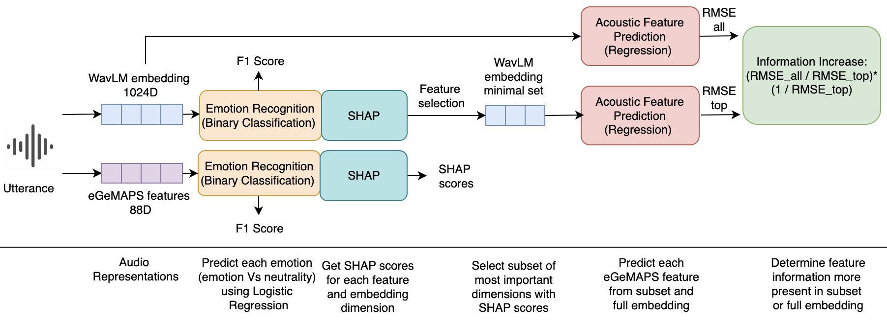

# Explaining Deep Learning Embeddings for Speech Emotion Recognition
This GitHub repository contains code and resources for the paper titled **"Explaining Deep Learning Embeddings for Speech Emotion Recognition by Predicting Interpretable Acoustic Variables"**. In this project, we explore the use of deep learning embeddings for speech emotion recognition (SER) and propose a method to explain the underlying acoustic features captured by these embeddings.

<p align="center"></p>

## Abstract
Speech emotion recognition (SER) is used for many applications including mental health assessments. Pre-trained self-supervised deep learning embeddings have shown superior performance over traditional handcrafted features. Explaining these audio deep learning representations is key to improve trust and advance the science of what acoustic information characterizes each emotion in speech such as high or low fundamental frequency or loudness. We first demonstrate that a deep learning embedding (Hybrid BYOL-S) outperforms a standard handcrafted feature set (eGeMAPS) using Ridge regression on the EmoDB dataset. To understand what acoustic information is used by the deep learning embedding model we probe it by predicting interpretable handcrafted feature values from the most important deep learning embedding dimensions for classifying a given emotion. This method allows us to (a) verify whether the features known to be relevant in classifying an emotion are represented within the top embedding dimensions, and (b) challenge data-driven findings that use handcrafted features that state that certain features seem to be required for detecting an emotion by showing a better performing model does not depend on that information. We provide a tutorial so this approach can be leveraged on other datasets or embeddings. 

## Repository Structure
- ```notebooks``` contains a full demo of our method being applied to the RAVDESS dataset and a notebook to get all the plots 
- ```modules``` contains code for feature extraction, preprocessing, emotion classification, feature importance and regression 

## Installation

To get started, follow the steps below:

1. **Create a Conda environment with Python 3.10:**

      ```bash
      conda create -n myenv python=3.10
      conda activate myenv
      ```

2. **Install dependencies:**

      After activating the environment, run the following command to install the required dependencies:

      ```bash
      pip install -r requirements.txt
      ```

3. **Create a `kaggle.json` file:**

      You will need a Kaggle account to access certain datasets. Follow these steps:

      - Log into your Kaggle account.

      - Navigate to your account settings, and create an API token. Fill the `kaggle.json` file, which must be structured as the `kaggle.json.example` file. 

4. **Run the Jupyter Notebooks:** 

      Navigate to the notebook folder and run the `.ipynb` files in Jupyter Notebook.

## Citation
```
@misc{dixit2024explainingdeeplearningembeddings,
      title={Explaining Deep Learning Embeddings for Speech Emotion Recognition by Predicting Interpretable Acoustic Features}, 
      author={Satvik Dixit and Daniel M. Low and Gasser Elbanna and Fabio Catania and Satrajit S. Ghosh},
      year={2024},
      eprint={2409.09511},
      archivePrefix={arXiv},
      primaryClass={cs.SD},
      url={https://arxiv.org/abs/2409.09511}, 
}
```

Thank you for your interest in our research, and we hope this repository proves valuable in your exploration of deep learning embeddings for speech emotion recognition and interpretability analysis.


